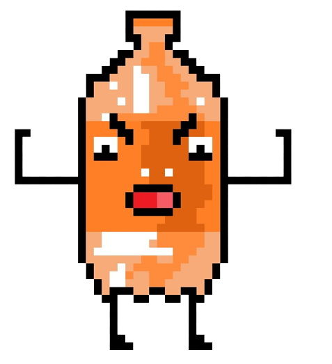

<h1 align="center">2022-303-Little Pitchula</h1>

 <h2>Índice</h2> 

* [Título e Imagem de capa](#titulo-e-imagem-de-capa)
* [Índice](#índice)
* [Descrição do Projeto](#descrição-do-projeto)
* [Status do Projeto](#status-do-projeto)
* [Ideia do Jogo](#ideia-do-jogo)
* [Personagens](#personagens)
* [Funcionalidades e Demonstração da Aplicação](#funcionalidades-e-demonstração-da-aplicação)
* [Acesso ao Projeto](#acesso-ao-projeto)
* [Tecnologias utilizadas](#tecnologias-utilizadas)
* [Pessoas Desenvolvedoras do Projeto](#pessoas-desenvolvedoras)
* [Conclusão](#conclusão)

<h2 align = "left">Little Pitchula</h2>

<h2 align = "left">Descrição do Projeto</h2>

Jogo de plataforma com a personagem Pitchulinha, com objetivo de coletar a dívida de outras bebidas e diminuir sua dívida co o fantinha.

<b>Menu Inicial:</b>

Botões de jogar e opções

Ao clicarmos em options, teremos a segunda cena do menu, que nos dá as opções de acessibilidade do jogo:

 <b>Opções:</b>

Menu Options, com personalização de volume, narração e adaptações para daltônicos.

 <b>Cena 1:</b>

</img>

  <b>Fase 1:</b>

<h2 align = "left">Status do Projeto</h2>

Com menu em desenvolvimento

<h2 align = "left">Ideia do Jogo</h2>

Little Pitchula é uma pequena e inocente refrigerante que gostava 
muito de jogar nas horas vagas. Porém, após perder toda sua fortuna durante 
uma partida de truco, ela se vê sem opção a não ser passa a trabalhar para 
Fantinha, um agiota que coordena o crime local. Little Pitchula agora 
é encarregada de coletar as dívidas de jogo de outras bebidas.

<h2 align = "left">Personagens</h2>
<ul  align ="center" style="list-style: none;">
  <li>
    
<b>Pitchulinha</b>

    </img>
    

      Protagosnista e cobradora do fantinha
    

  </li>
   
  <li>
    
<b>Brejinha</b>

    </img>
    

      Caloteiro profissional, o mais de díficil de cobrar(praticamente o Seu Madruga).
    

  </li>
   
  <li> 
    
<b>Garrafa</b>

    </img>
    

      Caloteiro fácil de cobrar, dívida barata.
    

  </li>
   
  <li>  
    
<b>Tinto</b>

    </img>
    

      Devedor médio, ném díficil, nem impossível.
    

  </li>
   
  <li>
    
<b>Fantinha</b>

    </img>
    

      O próprio, em PET e osso, Fantinha. O agiota mais temido do reino das bebidas.
    

  </li>
   
</ul>

<h2 align = "left">Funcionalidades e Demonstração da Aplicação</h2>

O jogo vai funcionar controlando a personagem Pitchulinha pelos botões de setas(left, right e barra) no teclado
enquanto ela anda e coleta as dívidas.

<h2 align = "left">Acesso ao Projeto</h2>

Em Little Pitchula é possível encontar opções de sons para acessibilidade maior durante a partida.

 
<h2 align = "left">Tecnologias utilizadas</h2>
<ul>
 <li>Unity</li>
</ul>

<h2 align = "left">Pessoas Desenvolvedoras</h2>
<ul>
  <li><a href="https://github.com/deblah">Deborah</a></li>
  <li><a href="https://github.com/wanessamarcos">Wanessa</a></li>
  <li><a href="https://github.com/eumariaw">Waleska</a></li>
  <li><a href="https://github.com/M0SELL1">Luiza</a></li>
  <li><a href="https://github.com/isacccosta">Isabela</a></li>
</ul>

<h2 align = "left">Conclusão</h2>

Little Pitchula é um jogo desenvolvido com muito carinho 
e que representa muito para as desenvolvedoras.
 
Feito inspirado na nossa realidade. 
Espero que seja uma experiência avassaladora pra todos os envolvidos.

